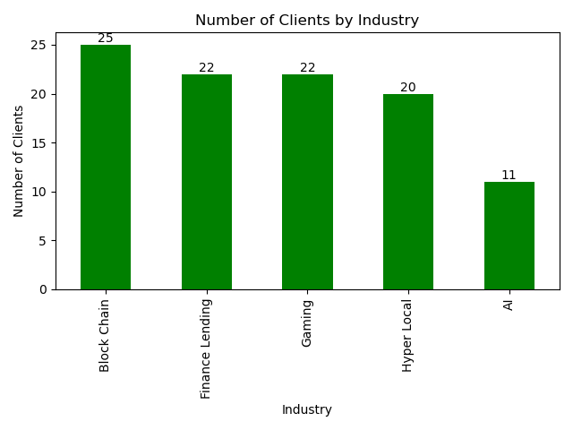
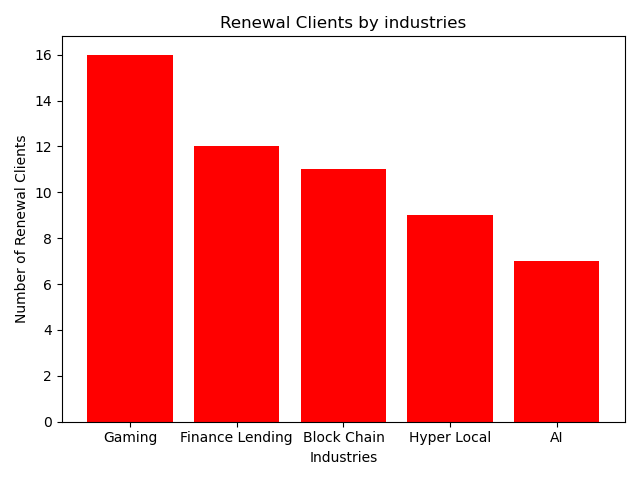
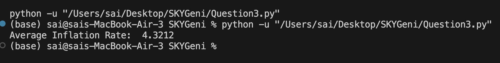
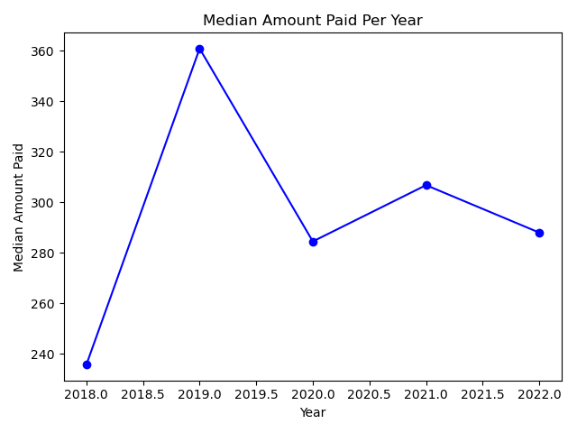

# 📊 SkyGeni Assignment

---

## 🔍 Questions

1. **How many Finance Lending and Blockchain clients does the organization have?**  
2. **Which industry in the organization has the highest renewal rate?**  
3. **What was the average inflation rate during subscription renewals?**  
4. **What is the median amount paid each year across all payment methods?**

---

## 📁 Datasets Used

- **`financial_information.csv`** – Contains financial indicators like inflation rate and GDP growth.  
- **`industry_client_details.csv`** – Contains client information, including industry type and client ID.  
- **`payment_information.csv`** – Contains records of payments made by clients, including payment methods and amounts.  
- **`subscription_information.csv`** – Contains subscription details, such as subscription type, renewal status, and relevant dates.

---

## 🛠️ Technologies and Libraries Used

- **Python**  
- **pandas** – For data manipulation and analysis.  
- **matplotlib** – For data visualization.

---

## ✅ Question 1: Number of Clients by Industry

  
- Blockchain – 25  
- Finance Lending – 22  
- Gaming – 22  
- Hyper Local – 20  
- AI – 11

---

## ✅ Question 2: Renewal Clients by Industry

  
**Maximum Renewals:**  
- Gaming – 16

---

## ✅ Question 3: Average Inflation Rate During Renewals

  
- **Average Inflation Rate:** 4.3212%

---

## ✅ Question 4: Median Amount Paid Per Year

  
- 2018 – 235.7  
- 2019 – 360.9  
- 2020 – 284.5  
- 2021 – 306.8  
- 2022 – 288.0

---

## 🧑‍💻 How to Run the Project

1. **Clone the repository**:

   ```bash
   git clone https://github.com/yourusername/data-analysis-subscription.git
   cd data-analysis-subscription
